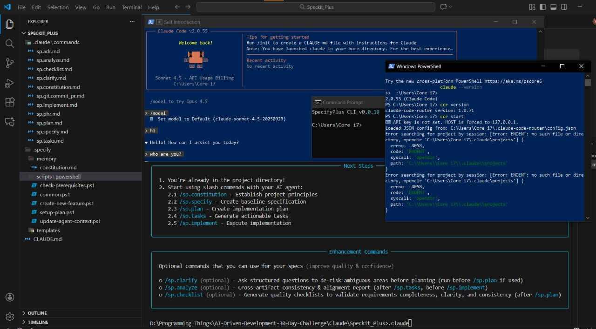

# 🚀 Claude Code + Gemini Setup (Windows Guide)

This guide walks you through setting up **Claude Code + Gemini models** on **Windows** using:

* `claude-code`
* `claude-code-router`

By the end, you will have a fully working setup for local AI development with Claude Code and Gemini models.

---

## Introduction

**Claude Code + Gemini** allows you to run AI models locally. Benefits include:

* Access Gemini models via Google AI Studio API.
* Run Claude Code commands locally.
* Build AI-powered projects without cloud limitations.

This guide is designed for **Windows 10/11**.

---

## Requirements

* Windows 10 or 11
* Node.js version **18+**
* NPM (comes with Node.js)
* PowerShell (Run as Administrator for some steps)
* Google AI Studio account for API Key

---

## Step 0 — Confirm Node.js

Open **PowerShell**:

```powershell
node --version
```

* ✅ Node.js version ≥ 18 → proceed
* ❌ If not → install Node.js

---

## Step 1 — Get Google API Key

1. Open Google AI Studio.
2. Click **Get API Key** → **Create API Key**.
3. Copy your API Key for later use.

---

## Step 2 — Install Required Tools

Open **PowerShell as Administrator**:

```powershell
npm install -g @anthropic-ai/claude-code @musistudio/claude-code-router
```

This installs:

* `claude-code` CLI
* `claude-code-router` for managing AI providers

---

## Step 3 — Create Config Folders

```powershell
mkdir $HOME\.claude-code-router
mkdir $HOME\.claude
```

---

## Step 4 — Create `config.json`

Windows does not support `cat << EOF`. Use **Notepad**:

```powershell
notepad $HOME\.claude-code-router\config.json
```

Paste the following JSON:

```json
{
  "LOG": true,
  "LOG_LEVEL": "info",
  "HOST": "127.0.0.1",
  "PORT": 3456,
  "API_TIMEOUT_MS": 600000,
  "Providers": [
    {
      "name": "gemini",
      "api_base_url": "https://generativelanguage.googleapis.com/v1beta/models/",
      "api_key": "$GOOGLE_API_KEY",
      "models": [
        "gemini-2.5-flash",
        "gemini-2.0-flash"
      ],
      "transformer": {
        "use": ["gemini"]
      }
    }
  ],
  "Router": {
    "default": "gemini,gemini-2.5-flash",
    "background": "gemini,gemini-2.5-flash",
    "think": "gemini,gemini-2.5-flash",
    "longContext": "gemini,gemini-2.5-flash",
    "longContextThreshold": 60000
  }
}
```

Save and close Notepad.

---

## Step 5 — Set Google API Key

Open **PowerShell (Admin)**:

```powershell
[System.Environment]::SetEnvironmentVariable('GOOGLE_API_KEY', 'YOUR_KEY_HERE', 'User')
```

Replace `'YOUR_KEY_HERE'` with your actual API Key.

✅ Verify:

```powershell
echo $env:GOOGLE_API_KEY
```

---

## Step 6 — Verify Installation

```powershell
claude --version
ccr version
echo $env:GOOGLE_API_KEY
```

If all commands work → ✅ Setup success.

---

## Step 7 — Daily Workflow

### Terminal 1 (Router):

```powershell
ccr start
```

Wait for:

```
✔ Service started successfully
```

### Terminal 2 (Project):

```powershell
cd your-project-folder
ccr code
```

---

## Step 8 — Verification Test

```powershell
ccr code
```

Type:

```
hi
```

If Claude replies → 🎉 **Setup is working!**

---


